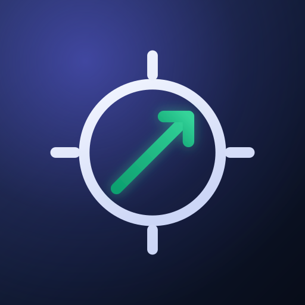
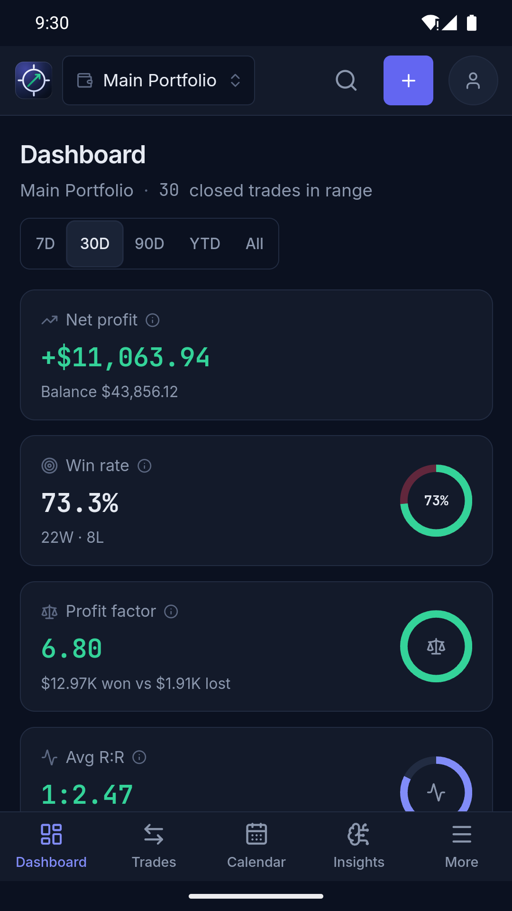
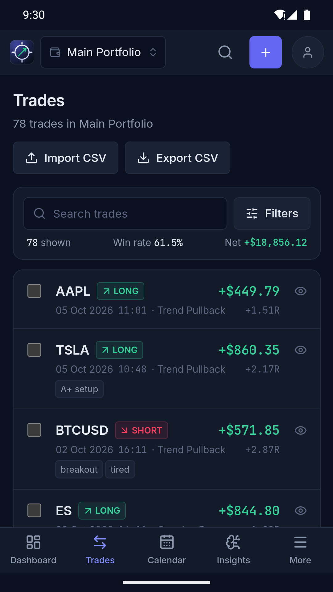
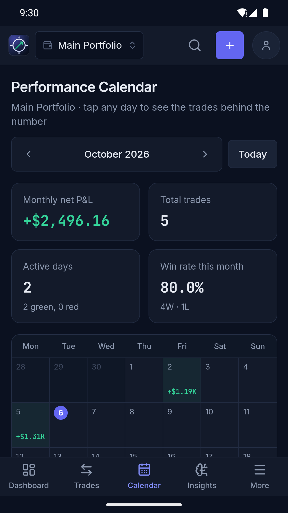
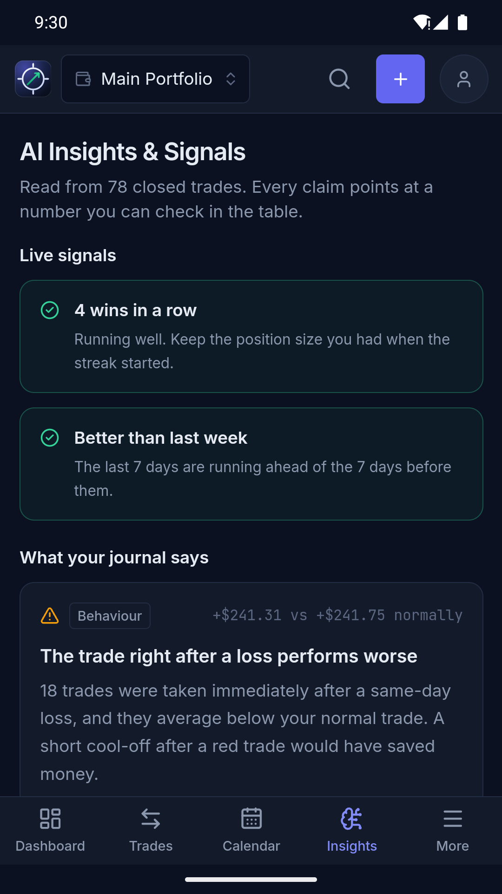

<p align="center">
  
</p>

<h1 align="center">Sniper Journal</h1>

<p align="center">
  A private trading journal and performance dashboard.<br />
  Runs on a Windows PC and on Android. No account, no server, no internet
</p>

<p align="center">
  
  
  
  
</p>

---

## What it does

You log your trades, and the app turns them into the numbers that show whether
you have an edge.

- **Log every detail.** Symbol, long or short, entry and exit, size, stop
  loss, take profit, fees, leverage, session, playbook setup, tags, notes, a
  chart screenshot, and 1–5 ratings for discipline, execution and patience.
  Futures and forex are handled with a contract multiplier, or enter the P&L
  by hand.
- **Dashboard.** Net profit, win rate, profit factor, average R:R, expectancy,
  system quality (SQN), commissions, streaks, best and worst day, an equity
  curve with max drawdown, daily P&L and a seven-axis Sniper Score.
- **Calendar.** Every day's net P&L at a glance; open a day to see its trades.
- **Trades.** Search and filter by pair, session, leverage, setup, date,
  direction and result. Edit trades in bulk, merge partial fills back into one
  position, or keep a trade but leave it out of the statistics.
- **Broker import.** CSV import with a preview before anything is added,
  including paired buy/sell exports such as Tradovate's, whose fill IDs are
  remembered so re-importing never adds a fill twice. CSV export too.
- **Playbook.** The setups you allow yourself to trade, their rules, and how
  each one actually performs.
- **Insights & signals.** Patterns found in your own trades, such as your best
  session and worst weekday, the trade straight after a loss, holding losers
  longer than winners, and tags that lose money, plus warnings when you near
  your own daily loss or trade-count limits.
- **Reports.** Month by month, and broken down by symbol, setup and weekday.
- **Several accounts**, viewed one at a time or all together, in a dark or
  light theme.

## Private by design

Your journal never leaves your device.

- **PC:** one JSON file, `data/journal.json`, inside the app folder, with a
  dated copy kept every day you make changes (the last 30 are kept).
- **Android:** the app's own private storage. The app requests **no
  permissions at all**, not even internet access, and Android's cloud backup is
  switched off. Uninstalling deletes the journal, so back it up from
  **More → Back up your journal**.

There are no accounts, ads, analytics or crash reporting. Backups are plain
JSON files you export and restore yourself. See
[the privacy policy](docs/privacy-policy.md).

## Getting started

### On a Windows PC

Install [Node.js](https://nodejs.org) (LTS), put this folder somewhere
permanent, and double-click **`INSTALLER.bat`**. It builds the app, adds a
desktop shortcut and runs it quietly in the background at
<http://localhost:3000>. The full walkthrough, with troubleshooting, is in the
[user guide](docs/user-guide.md).

### On Android

The Android app is built from this same code with
[Capacitor](https://capacitorjs.com). To install a test build on a phone or
emulator, see [Building the Android app](#building-the-android-app) below.

## Development

```bash
npm install          # once
npm run dev          # http://localhost:3000, with live reload
npm run typecheck    # the project is strict TypeScript
npm run build        # the desktop app
```

Stop the background copy (`stop.bat`) before running a dev server, or the two
will fight over port 3000 and over `data/journal.json`.
[`DEVELOPING.md`](DEVELOPING.md) is the map of the codebase.

### Building the Android app

Needs a JDK 21 (`JAVA_HOME`) and the Android SDK (`ANDROID_HOME`). Android
Studio provides both, but neither needs Android Studio itself.

```bash
npm run build:mobile         # static export into out/ (leaves the desktop build alone)
npx cap sync android         # copy it into the Android project
cd android && gradlew assembleDebug
adb install -r app/build/outputs/apk/debug/app-debug.apk
```

`npm run android` does the first two steps and opens Android Studio, if it is
installed.

**Live reload on a phone:** run `npm run dev`, then
`adb reverse tcp:3000 tcp:3000`, sync with `CAP_LIVE_URL=http://localhost:3000`
set and install a debug build. The app then loads from your PC and updates as
you save. A plain `npx cap sync android` switches back. Release builds refuse to
build while the dev-server setting is synced in.

### Releasing to Google Play

1. **Once:** create the upload key. Copy
   `android/keystore.properties.example` to `android/keystore.properties` and
   follow the instructions inside it. The key and that file are gitignored;
   back both up somewhere other than this PC.
2. **Every release:** bump the version with `npm version patch` (or `minor` /
   `major`). The Android version code is derived from it, so it always goes up.
3. `npm run bundle` builds, signs and verifies
   `android/app/build/outputs/bundle/release/app-release.aab`.
4. Upload it in Play Console. The store listing text is in
   [`docs/play-store-listing.md`](docs/play-store-listing.md) and the artwork in
   `assets/play-store/`. `npm run icons` redraws every icon from the one logo.

## How the code is organised

```
src/
  app/            one folder per page; api/ holds the desktop server's routes
  views/          the content of each page
  components/     layout (header, sidebar, tab bar), trade form, charts, UI pieces
  store/          the journal state, saving, and validation of loaded data
  lib/            calculations: stats, insights, CSV, trade maths. No React.
  lib/storage/    the only code that touches files: web.ts (PC), capacitor.ts (Android)
android/          the Capacitor Android project
scripts/          mobile build, Play bundle, icon generator
docs/             user guide, privacy policy, store listing
```

All storage goes through one interface in `src/lib/storage/`, and the one
platform check in the codebase is `pick()` in `src/lib/storage/index.ts`.
Anything else that differs between PC and phone reads `storage.kind`.

## Ground rules

1. Don't change the calculations in `src/lib/` (stats, insights, CSV, trade
   maths). They are tested, and every number in the app rests on them.
2. The desktop app must keep working after every change. Run `npm run build`
   and open it on the PC before calling something done.
3. Run `npm run typecheck` before finishing anything.
4. If you change the shape of the journal, update `normalize()` in
   `src/store/JournalProvider.tsx` so existing journals still load.
5. Keep it offline. The app makes no network requests and keeps no telemetry.

## Built with

Next.js 16, React 19, TypeScript, Tailwind CSS 4, Recharts, Lucide icons and
Capacitor 8.
